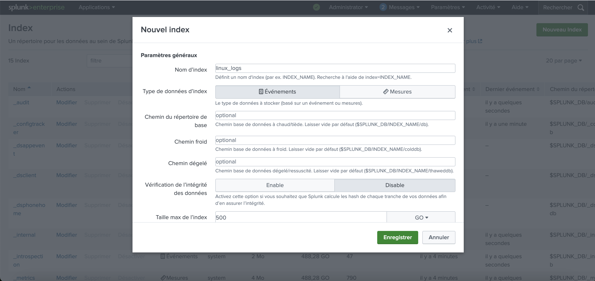
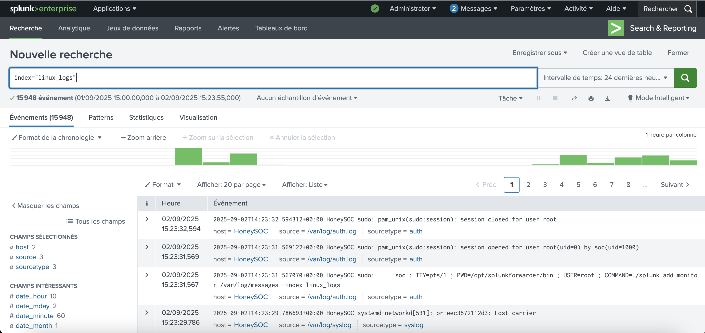

# 🛡️ Splunk SIEM Lab

---


---

A **hands-on lab** environment for learning, testing, and showcasing **Splunk** as a **Security Information and Event Management (SIEM)** solution.  
This lab demonstrates how to **collect, analyze, and visualize security events** using **Splunk Enterprise** and **Splunk Universal Forwarder**.

---

## 🚀 Features

- Install and configure **Splunk Enterprise**  
- Add **data inputs** for security logs  
- Deploy **Splunk Universal Forwarders** on remote machines  
- Centralize and visualize logs for **SOC monitoring**  

---

## 🏗️ Lab Architecture

- **Splunk Enterprise Server** → Central SIEM  
- **Universal Forwarders** → Remote log collectors (Linux/Windows)  
- **Data Sources** → System logs, authentication logs, etc.  

---

## ⚙️ Requirements

- Virtualization tool (VMware / VirtualBox / Proxmox)  
- Linux-based VM for Splunk Enterprise  
- Additional VMs (optional) for forwarders  
- At least **4 GB RAM + 2 vCPU** for Splunk Enterprise  

---

## 📖 Setup Guide

This section provides step-by-step instructions to set up the **Splunk SIEM Lab**, including installing Splunk Enterprise, configuring the receiver, and installing/configuring the Universal Forwarder on a Linux victim machine.

### 1️⃣ Install Splunk Enterprise on the SIEM VM

1. Download the latest Splunk Enterprise for Linux:

```bash
wget -O splunk-10.0.0-linux-x86_64.tgz "https://www.splunk.com/page/download_track?file=10.0.0/linux/splunk-10.0.0.tgz"
```

2. Extract the tarball to `/opt`
   
```bash
sudo tar -xvzf splunk-10.0.0-linux-x86_64.tgz -C /opt
```

3. Start Splunk and accept the license

```bash
cd /opt/splunk/bin
sudo ./splunk start --accept-license
```

4. Enable Splunk to start at boot

```bash
sudo ./splunk enable boot-start
```

5. Open your browser and go to Splunk Web

```bash
http://<SIEM_VM_IP>:8000
```


### 2️⃣ Configure Data Reception on Splunk (Port 9997)

After installing Splunk Enterprise, the next step is to configure it to **receive logs from remote machines** using the Splunk Universal Forwarder.

1. Log in to the Splunk Web interface
2. Navigate to **Settings → Forwarding and receiving → Receive data**.
3. Click **New Receiving Port**.
4. Enter **9997** as the port number.
5. Save the configuration.


### 3️⃣ Create a Custom Index

Creating a custom index helps organize incoming logs for better management and searching.

1. Go to **Settings → Indexes → New Index**.
2. Enter the index name:
```bash
linux_logs
```
3. Click **Save**.




### 4️⃣ Install and Configure the Splunk Universal Forwarder on a Remote VM

To collect logs from remote machines and send them to your Splunk Enterprise server, you need to install the **Splunk Universal Forwarder** on each target VM.

**Step 4.1: Download and Install the Forwarder**

1. SSH into the remote VM (Linux example):
```bash
ssh user@<REMOTE_VM_IP>
```

2. Download the latest Universal Forwarder:
```bash
wget -O splunkforwarder-10.0.0-linux-x86_64.tgz "https://www.splunk.com/page/download_track?file=10.0.0/universalforwarder/linux/splunkforwarder-10.0.0.tgz"
```

3. Extract the tarball to `/opt`:
```bash
sudo tar -xvzf splunkforwarder-10.0.0-linux-x86_64.tgz -C /opt
```

4. Start the forwarder and accept the license:
```bash
cd /opt/splunkforwarder/bin
sudo ./splunk start --accept-license
```

5. Enable the forwarder to start at boot:
```bash
sudo ./splunk enable boot-start
```

**Step 4.2: Configure Forwarding to the Splunk Server**

1. Add your Splunk Enterprise server as the receiving target:
```bash
sudo ./splunk add forward-server <SIEM_VM_IP>:9997 -auth admin:<SPLUNK_PASSWORD>
```

2. Add monitors to send system logs and authentication logs to your custom index `linux_logs`:
```bash
sudo ./splunk add monitor /var/log/syslog -index linux_logs
sudo ./splunk add monitor /var/log/auth.log -index linux_logs
```

3. Restart the forwarder to apply the changes:
```bash
sudo ./splunk restart
```

**Step 4.3: Verify Forwarder Connection**

1. Log in to the Splunk Web interface.
2. Go to **Discover & Search**.
3. Run the following search to verify logs are being indexed correctly:
```bash
index="linux_logs"
```
4. You should see entries from both `syslog` and `auth.log`, confirming that the forwarder is successfully sending logs to your Splunk server.



---

## ✅ Conclusion

This lab provides a hands-on setup for **Splunk Enterprise** and **Universal Forwarders**, showing how to collect, index, and search logs from remote machines. With this foundation, you can start exploring SIEM workflows, monitoring security events, and building dashboards for SOC analysis.
