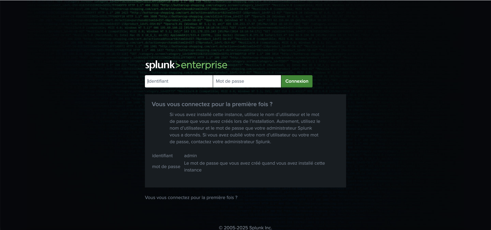
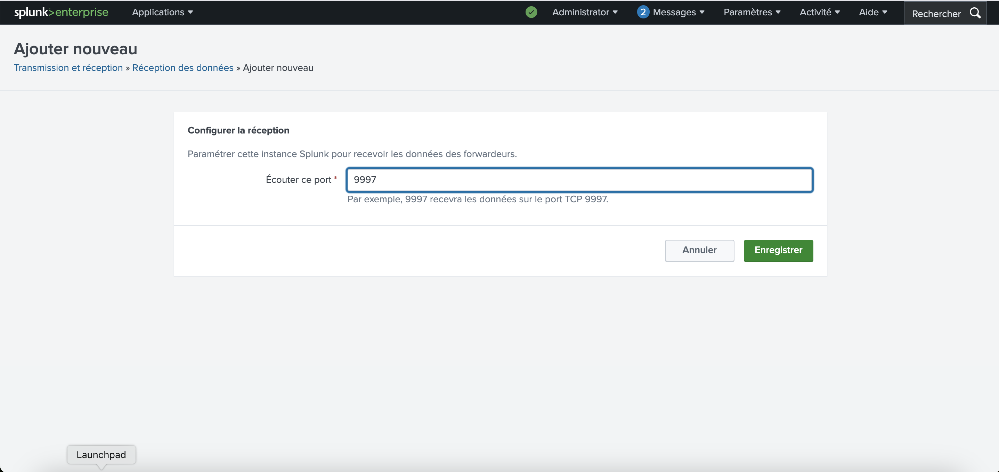

# 🛡️ Splunk SIEM Lab

A hands-on lab environment for learning, testing, and showcasing **Splunk** as a Security Information and Event Management (SIEM) solution.  
This lab demonstrates how to collect, analyze, and visualize security events using Splunk Enterprise and Splunk Universal Forwarder.

---

## 🚀 Features
- Install and configure **Splunk Enterprise**  
- Add **data inputs** for security logs  
- Deploy **Splunk Universal Forwarders** on remote machines  
- Centralize and visualize logs for **SOC monitoring**  

---

## 🏗️ Lab Architecture
- **Splunk Enterprise Server** → Central SIEM  
- **Universal Forwarders** → Remote log collectors (Linux/Windows)  
- **Data Sources** → System logs, authentication logs, honeypot logs, etc.  

---

## ⚙️ Requirements
- Virtualization tool (VMware / VirtualBox / Proxmox)  
- Linux-based VM for Splunk Enterprise  
- Additional VMs (optional) for forwarders  
- At least **4 GB RAM + 2 vCPU** for Splunk Enterprise  

---

## 📖 Setup Guide

This section provides step-by-step instructions to set up the **Splunk SIEM Lab**, including installing Splunk Enterprise, configuring the receiver, and installing/configuring the Universal Forwarder on a Linux victim machine.

### 1️⃣ Install Splunk Enterprise on the SIEM VM

1. Download the latest Splunk Enterprise for Linux:

```bash
wget -O splunk-10.0.0-linux-x86_64.tgz "https://www.splunk.com/page/download_track?file=10.0.0/linux/splunk-10.0.0.tgz"
```

2. Extract the tarball to `/opt`
   
```bash
sudo tar -xvzf splunk-10.0.0-linux-x86_64.tgz -C /opt
```

3. Start Splunk and accept the license

```bash
cd /opt/splunk/bin
sudo ./splunk start --accept-license
```

4. Enable Splunk to start at boot

```bash
sudo ./splunk enable boot-start
```

5. Open your browser and go to Splunk Web

```bash
http://<SIEM_VM_IP>:8000
```




### 2️⃣ Configure Data Reception on Splunk (Port 9997)
After installing Splunk Enterprise, the next step is to configure it to ***receive logs from remote machines*** using the Splunk Universal Forwarder.

1. Log in to the Splunk Web interface
2. Navigate to ***Settings → Forwarding and receiving → Receive data***.
3. Click ***New Receiving Port***.
4. Enter ***9997*** as the port number.
5. Save the configuration.




